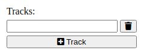
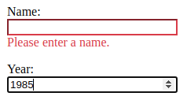

## Before Exercises:

Before the exercise, if you want to work with jQuery, you need to add it to your HTML file.
There are several ways of doing this, including downloading the js file from the [official web page](https://jquery.com/).
You can also link a jQuery file already provided in a [server](https://code.jquery.com/) (in this case, use *minified* version).

We are going to use a docker image for the exercises.
If you have not yet installed docker, please follow the [official documentation](https://docs.docker.com/engine/install/https://docs.docker.com/engine/install/).

## Exercise: Familiarize with JS

Solve the first exercise [Looping a triangle](https://eloquentjavascript.net/02_program_structure.html#i_umoXp9u0e7).

Extend your triangle code to a function that expects a size parameter.
For example, the call to ``triangle(5)`` should give the following output in the console:

        #
        ##
        ###
        ####
        #####

Extend the previous function with an **optional** parameter which defines the character to be printed.
For example ``triangle(5,"%")`` prints the same triangle as before, with ``%`` instead.

## Exercise: Adding / Removing DOM elements

Now it is time to extend our previous exercise: the music album register.
With JavaScript, we are going to allow for a variable number of tracks to be added to the album.
The number of tracks can be up to 20, and it can never be less than 1.

To do this, you need a button to remove 1 track, and another button to add an input text for adding an extra track.
If clients cannot add or remove tracks, the correspondent button should be disable.
An example of the view can be seen here:

## Exercise: Form Validation Part 1

You have noticed that you can send any data in the inputs, or not sending data at all (empty fields).
Now it is your job to prevent this.
You are going to validate the form before being submitted.

To do this, you can capture the ``onsubmit`` event of a form.
Look at the [jQuery documentation](https://api.jquery.com/submit/).

When the form is not valid, you should notify the user that something went wrong with an alert or a message, and stop the submission of the form.
If it is valid, it should submit as normal.

## Exercise: Form Validation Part 2

Coming back to the validation exercise, now it is your job to inform the user what the problem is and where it is located.
If the form is not valid, it should notify the user like this:

*Is it enough to use JS as a validation strategy?* *Why?*

## Exercise: JSON data

We have prepared a server using docker [https://hub.docker.com/r/jazerix/rest-albums](https://hub.docker.com/r/jazerix/rest-albums).

Using this server, you have two tasks:

1. Add an index page with a list of created albums and a button to create a new one. This button should redirect to the form to create a new album.
2. The form should submit the data to the server. Then, manually, you should go to the index web page and check if the album has been uploaded.

To retrieve JSON data, you can use the jQuery function ``getJSON``.
The documentation can be found [here](https://api.jquery.com/jquery.getJSON/).

If you are not using jQuery, you can use the function ``fetch``.
You can check the documentation [here](https://www.w3schools.com/js/js_api_fetch.asp).
Instead of *file*, you should use the proper link to the server.
Because the response of the server is a JSON object, before using the data you should retrieve it from the response object with the function ``json()``.

## Extra exercise: More about JavaScript

Now that you feel more comfortable with JavaScript and DOM manipulation, you are going to develop a game, [Nim](https://en.wikipedia.org/wiki/Nim).
Start with a simple version:

* Start with a fixed number of sticks, e.g., 20 with only 1 heap.
* The players (you + computer) take turns to remove either 2 or 3 sticks.
* A player loses if he/she takes the last sticks.
* Start with a dump computer tactic that, e.g., always removes 2 sticks.
* Specify a simple UI with buttons and characters that represent the sticks.
* Print win or lose messages depending on the result of the game.

After this variation, you can upgrade your game by (in this order):

* Improve the UI: Uses images for the sticks, improve buttons interface, winning and losing messages, etc.
* Allow users to add the number of sticks.
* Allow users to add the number of heaps, and sticks per each heap.
* **Hard**: Improve computer strategy.

## Extra exercise: Validation on keypress

The validation of the form is being made only on submit.
Your job is to change this to validate for each keypress on the inputs.

*What approach is better?* *Why?*

*Do you think is there a better approach?*

Try to combine a keypress with a onsubmit approach to give the best user experience for this form.

## Extra exercise: keypress and responsiveness

It is your turn to be the *bad person*.
Change the previous keypress experience to make it feel slow to the user.
Experiment with *somewhat slow* to *typing almost unbearable*.

*With this new experience, what do you think is better? keypress or onsubmit?*
*Why?*
